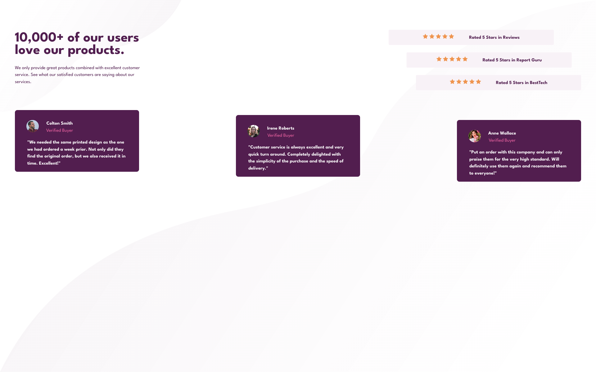

# Frontend Mentor - Social proof section solution

This is a solution to the [Social proof section challenge on Frontend Mentor](https://www.frontendmentor.io/challenges/social-proof-section-6e0qTv_bA). Frontend Mentor challenges help you improve your coding skills by building realistic projects. 

## Table of contents

- [Overview](#overview)
  - [The challenge](#the-challenge)
  - [Screenshot](#screenshot)
  - [Links](#links)
- [My process](#my-process)
  - [Built with](#built-with)
  - [What I learned](#what-i-learned)
  - [Continued development](#continued-development)
  - [Useful resources](#useful-resources)
- [Author](#author)
- [Acknowledgments](#acknowledgments)

## Overview

### The challenge

Users should be able to:

- View the optimal layout for the section depending on their device's screen size

### Screenshot

### Links

- Solution URL: (https://www.frontendmentor.io/solutions/social-proof-section-w0dYE6WQh0)
- Live Site URL: (https://sclingan.github.io/social-proof-section)

## My process

### Built with

- Semantic HTML5 markup
- CSS custom properties
- Flexbox
- CSS Grid
- Mobile-first workflow
- [React](https://reactjs.org/) - JS library

### What I learned

I learned a lot about Flexbox and how to make a responsive
layout. Using transform and translate in CSS to make offset
content is new to me, looking forward to trying more layouts
with it!

### Continued development

I want to come back to this challenge and use an API to get
all the users and their comments to dynamically load on the page,
I am excited about learning more on the backend.

### Useful resources

- (https://developer.mozilla.org/en-US/) - A great resource for all things web dev!
- (https://validator.w3.org/) - Test your Website!!!!!

## Author

- Frontend Mentor - [@sclingan](https://www.frontendmentor.io/profile/sclingan)

## Acknowledgments

Thanks to Frontend Mentor for another great challenge!
